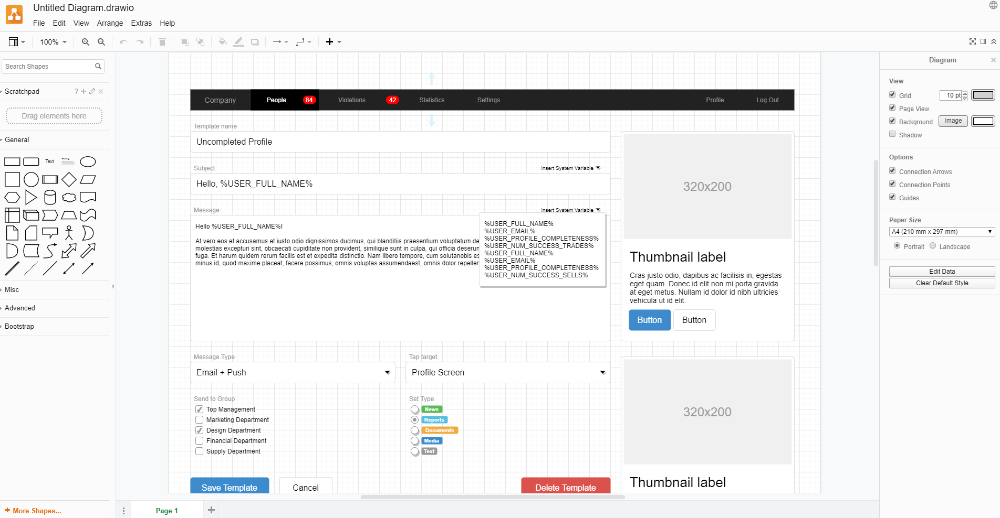
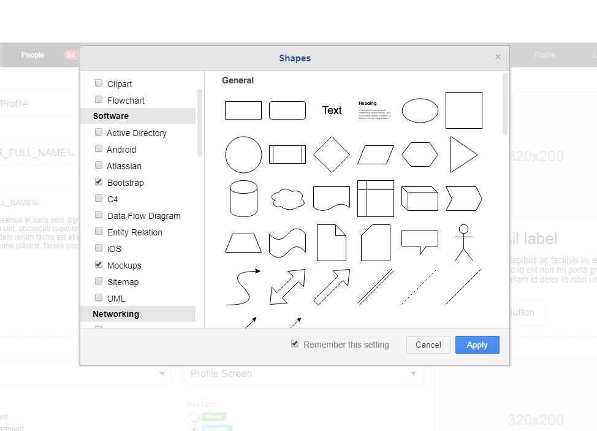
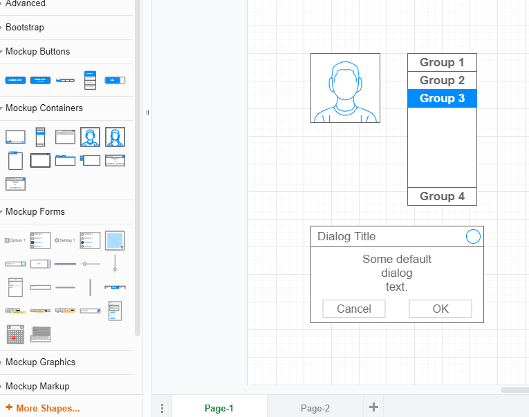
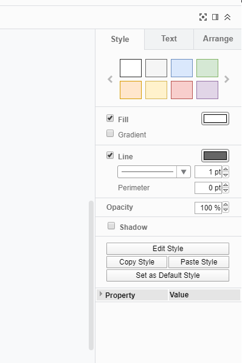
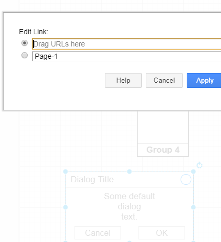
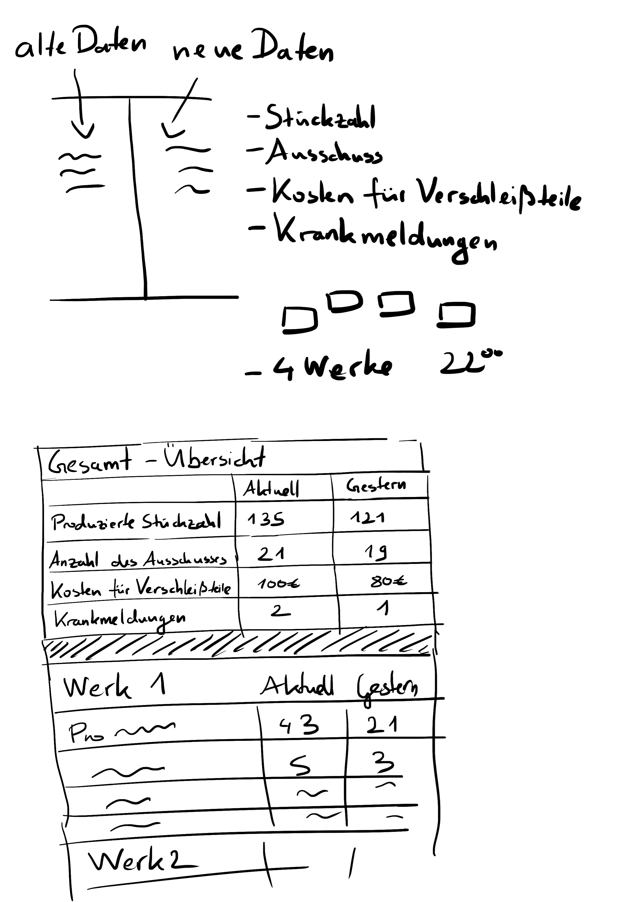
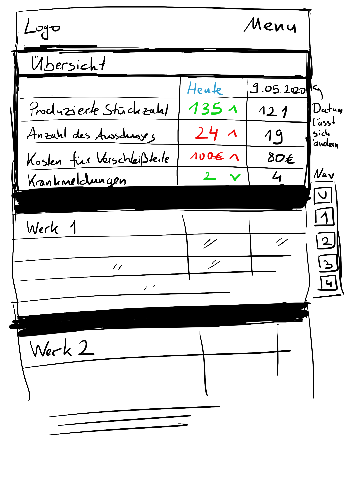
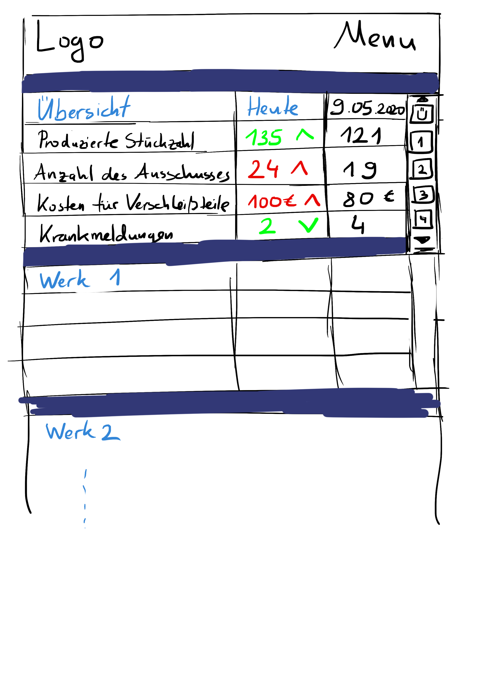

# Aufgabe 2 - Prototyping

## Aufgabe 2.1 – Prototyping Tool 

Draw.io ist ein GUI Tool, welches man auf dem Browser oder als Applikation benutzen kann. Es eignet sich sehr gut für Anfänger, da es kostenlos und einfach zu bedienen ist. Außerdem ist die Funktionalität des Tools für die meisten Projekte mehr als ausreichend.

**Kernfeatures:**
•	Kostenlos
•	Open Source
•	Vielseitig
•	Einfach

## Fidelity

**Interactivity: Gut**

Links können in Elemente eingebaut werden, die auf eine neue Page / Seite verlinken oder auf bestimmte Stellen im Dokument springen.

**Visuals: Mittel**

Bilddateien wie JPEG, PNG oder andere Formate können problemlos in das Tool eingebaut werden. Videos dagegen können nur durch externe Quellen in Form von Links und nicht direkt eingefügt werden.

**Content: Gut**

Inhalt lässt sich durch viele unterschiedliche Elemente gut darstellen.

## Komplexität
Das Tool ist sehr einfach zu bedienen und man braucht keine Vorkenntnisse.

## Grenzen
Videodateien lassen sich nicht direkt in das Tool einfügen. Nicht alle Funktionen sind kostenlos.

## Draw.io Beispielbilder

## Aufgabe 2.2 - Konzeptentwurf

