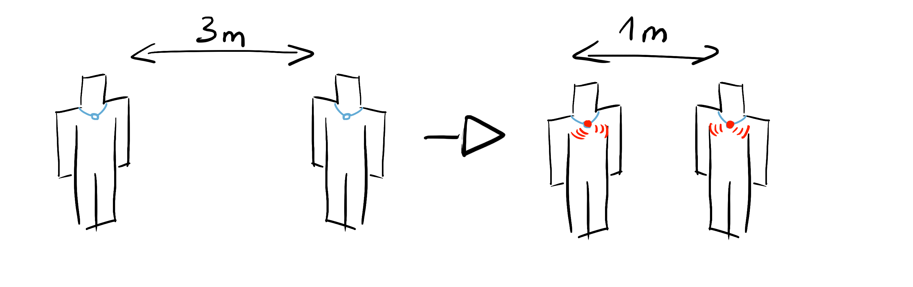

# 1 Grobkonzeptentwicklung

Die Idee ist eine Halskette zu entwickeln, die nicht bei Beachtung des Mindestabstands anfängt zu leuchten und zu vibrieren. Somit soll klar zu sehen und zu spüren sein, dass der Mindestabstand nicht eingehalten wird.

# 2 Prototype

Ein Prototype wurde mit dem Tool „Circuits“ erstellt. Hierbei leuchtet die LED rot auf, wenn der Mindestabstand nicht eingehalten wird. 

