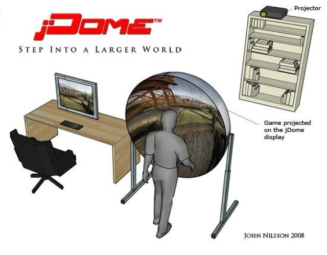
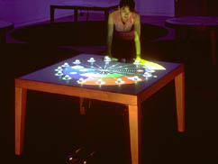
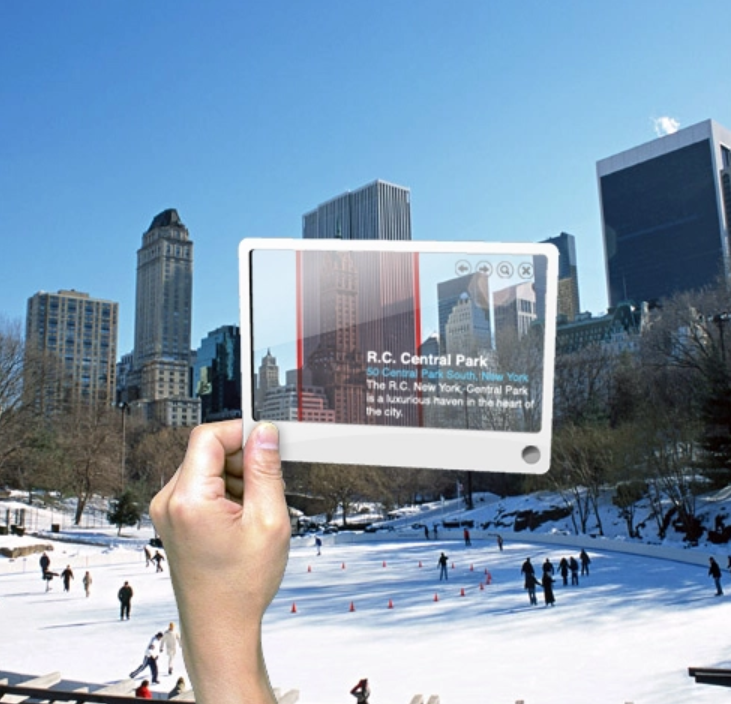

## jDome: New Level Of Gaming Experience

Hierbei handelt es sich um ein Gerät, welches das Sichtfeld in einem Spiel ändert und somit für bessere Spielerlebnisse sorgen soll.

## Composition Of The Table

Selbst wenn es sich um eine schon recht veraltete Technologie handelt, hat diese, meiner Meinung nach, noch viel Potential. Der Nutzer kann mit Handbewegungen mit den projizierten Bildern auf dem Tisch interagieren.

## Futuristic Glass

Hierbei handelt es sich um ein Device, welches verschiedenen Funktionen hat und im Allgemeinen die Umgebung erfassen und scannen kann. Dadurch kann der Nutzer auf viele, nützliche Informationen bequem und schnell zugreifen.

