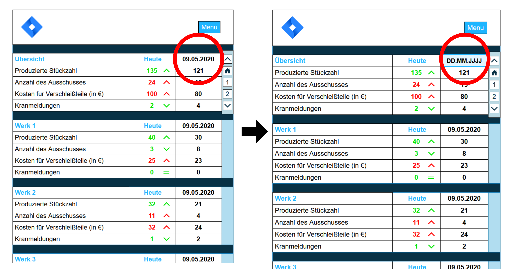
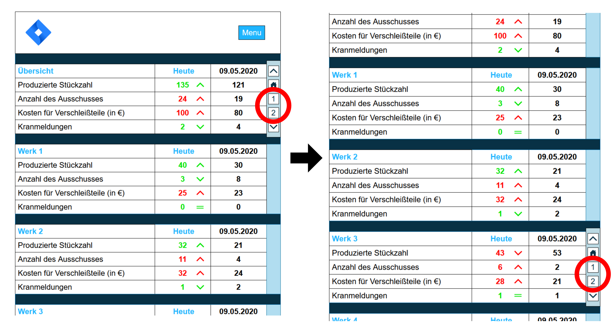
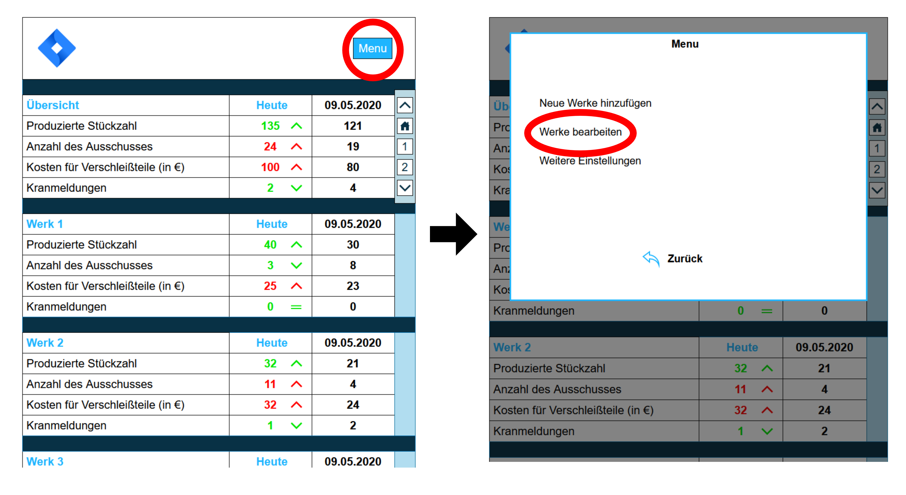
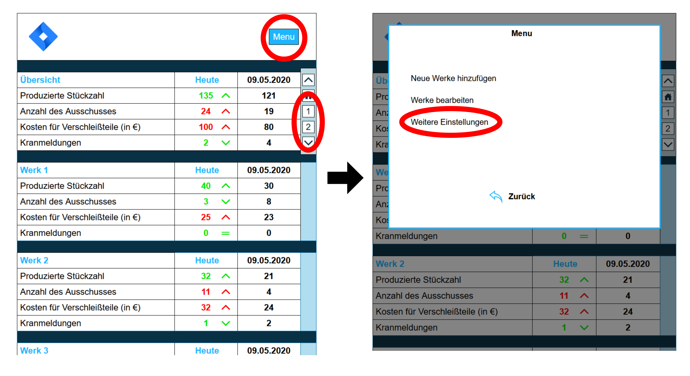
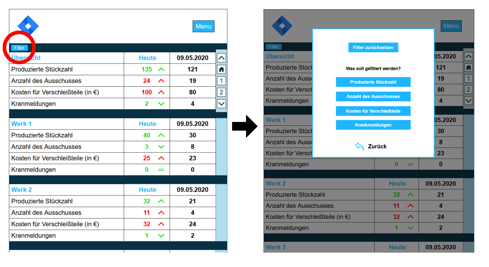
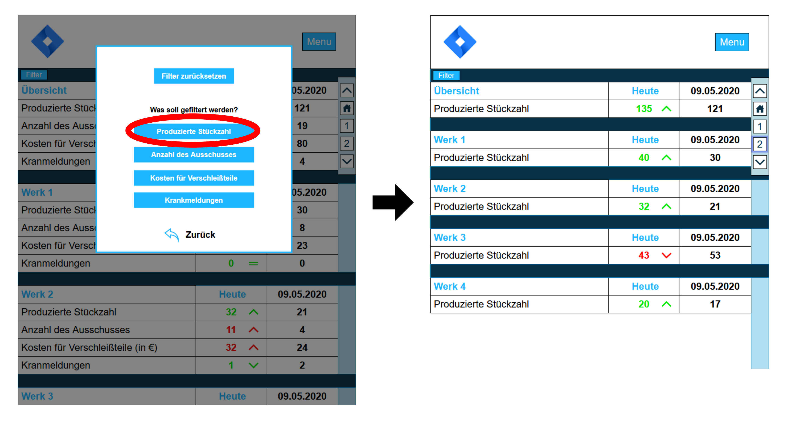
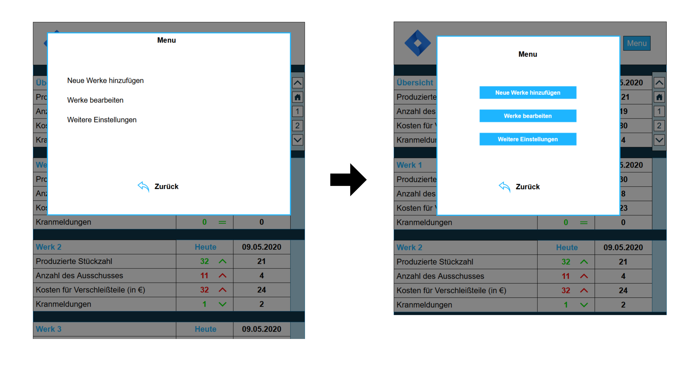
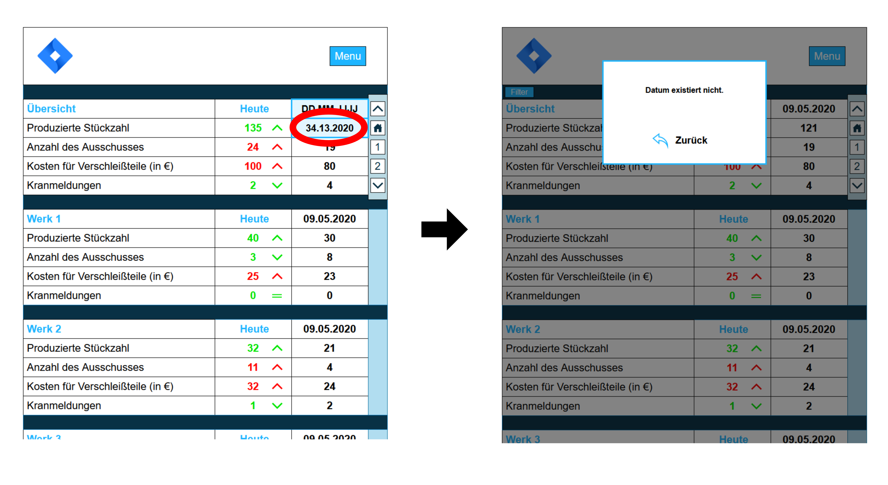

# Endaufgabe

## 1. Die Basis dieser Aufgabe bildete der GUI Prototype der Aufgabe 3.

## 2. Customer Journey Map
Bei dem Prototype handelt es sich um ein Produkt, welches speziell für einen Kunden konzipiert und entwickelt worden ist. Dieser Kunde wollte relevante Informationen schnell und einfach managen können, indem er, zum Beispiel, alte Datenständen mit aktuellen vergleichen konnte.

Kunde startet den Prototype. Er sieht eine Übersicht aller relevanten Informationen.
Je nachdem was sein Vorhaben ist, könnte er sich kurz die Übersicht angucken und das Programm gleich wieder schließen, wenn seiner Meinung nach alles in Ordnung ist. Er könnte aber auch den aktuellen Stand aller Werke mit einem anderen Tag vergleichen wollen. Dafür würde er auf das Datum klicken und sein Wunschdatum eintragen. 

Der Kunde könnte aber auch gleich wissen wollen, wie die einzelnen Werke so dastehen. Falls das gewünschte Werk nicht zu sehen ist und sich weiter unterhalb der Informationsseite befindet, kann er das Menu rechts benutzen und sich zum gewünschten Werk navigieren. 

Der Kunde könnte aber auch gleich erkennen, dass eine gewünschte Information nicht erhalten ist bzw. nicht aufgelistet wird. Hierbei würde er auf das Menü klicken und könnte durch „Werke bearbeiten“ diese anpassen.

Falls der Nutzer ein bestimmtes Werk gerne im Auge behalten und jederzeit zu diesem springen würde, könnte er die einzelnen Buttons rechts im Navigationsmenü anpassen. So könnte er gleich z.B. zum 4ten Werk springen.

## 3. Heuristische Evaluation

**Relevante Aufgaben des Prototypes:**
* Die Hauptaufgabe des Prototypen ist es Informationen übersichtlich und klar darzustellen.
* Die zweite Aufgabe ist es dem Nutzer die Möglichkeit zu geben seine Werke und die Anzahl der unterschiedlichen Informationsausgaben zu bearbeiten. Dieser Teil der Aufgabe existiert nur theoretisch und wurde nur als Zusatzfunktion eingeplant.

**Regeln** | **Bewertung** 
-------- | -------- 
Strive for consistency   | Farben, die Art der Darstellung der Informationen und die Interaktionsmöglichkeiten werden konsistent gehalten.
Cater to universality   | Der Prototype bietet wenig unterschiedliche Informationsquellen. Diese sind (1) Informationen direkt aus der Übersichtstabelle erhalten oder (2) durch das Angeben eines anderen Datums. Vielleicht eine Möglichkeit für erfahrene Nutzer einbauen spezifische Informationen filtern zu können?
Offer informative feedback | Fehlt teilweise, z.B. wenn ein Datum eingegeben wird und nicht existiert, muss das System ein Feedback geben. System gibt aber Feedback beim Vergleichen der Informationen der unterschiedlichen Tage z.B. ob die Produzierte Stückzahl sich erhöht hat. Vielleicht ein Art Tutorial einbauen, welches alles erklärt?
Design dialogs to yield closure | Informationen werden gruppiert. Nutzer wird nicht mit Informationen überfordert.
Prevent errors | Die Eingabe eines Datums wird validiert. Andere Fehlerquellen sind nicht vorhanden. Datepicker einbauen?
Permit easy reversal of actions | Fehlt, Nutzer kann z.B. nicht auf das vorher eingegebene Datum zurückspringen. Frage ist, ob das relevant ist, da der Nutzer unwahrscheinlich zurückspringen will.
Support internal locus of control | Nutzer sollte das Gefühl der Kontrolle haben, da es wenig unterschiedliche Interaktionsmöglichkeiten bei der Informationsübertragung gibt.
Reduce short-term memory load | Nutzer muss sich keine Informationen merken, außer er vergleicht unterschiedliche Werke miteinander. Eine Funktion einbauen, um unterschiedliche Werke miteinander vergleichen zu können? Relevant?
Richtlinie 1.4 - Unterscheidbar | Informationen lassen sich gut unterscheiden. > Kontrast für Farbenblinde testen.
Richtlinie 2.2 - Ausreichend Zeit | Es gibt keinen Zeitlimit.
Richtlinie 2.4 - Navigierbar | Nutzer kann durch den Navigationsblock sich zu unterschiedlichen Werken navigieren und dort auf Informationen zugreifen.
Richtlinie 3.1 - Lesbar | Inhalte sind lesbar und klar verständlich. Wie bei 1.4 > Kontrast für Farbenblinde testen.
Richtlinie 3.3 - Hilfestellung bei der Eingabe | Nicht notwendig, da alle Informationen gelesen werden und höchstens ein Datum eingeben wird.

**Zusammenfassung des ersten Tests:**
An sich sollte der Prototype für seine Aufgabe ausreichend sein, dennoch gibt es einige Verbesserungspunkte, wie z.B. die Möglichkeit geben bestimmte Informationen filtern zu können. Damit der Nutzer z.B. nur die Stückzahlen aller Werke sieht und nicht alle Informationen gleichzeitig.
Ein Tutorial wäre auch sinnvoll, welcher eine kurze Einführung über das Produkt und dessen Funktionalität gibt, damit auch andere Mitarbeiter, die neu dazukommen, damit zurechtkommen können.
Da es sich bei diesem Prototypen um ein Produkt eines Kunden handelts, müssen alle Änderungen erstmal mit diesem besprochen werden. Man nehme an, der Kunde sei mit den Verbesserungen seines Produktes einverstanden.

**Folgende Verbesserungen werden durchgeführt:**
* Filterfunktion
* Feedback wenn ein Datum nicht existiert

**Sekundäre Verbesserungen:**
* Tutorial einbauen
* Möglichkeit einbauen unterschiedliche Werke miteinander vergleichen zu können
* Datepicker, aber noch unsicher, ob es sinnvoll ist

Der zweite Test ist etwas problematisch, da die Funktionalität nur theoretisch und nicht praktisch existiert. Es war als eine mögliche Erweiterung geplant und nicht Teil des Kundenwunsches. Dazu kommt, dass der Prototype mit Draw.io erstellt wurde und dieses Tool nur begrenzte interaktive Funktionen bietet. 

## 5. Prototyp Enhancement

**Filter wurde eingebaut**

Wenn man auf den Button klickt erscheint ein Menü indem man aussuchen kann, was man filtern möchte. Alles wurde einfach und übersichtlich gestaltet.

Klickt man beispielsweise auf „Produzierte Stückzahl“, werden nur diese angezeigt. Dadurch soll der Kunde bestimmte Informationen besser vergleichen können.

Mir ist dabei aufgefallen, dass die Darstellung des Menüs sich stark von der Darstellung des Filters unterscheidet und somit Shneidermans erste Regel gebrochen wird. Dies wurde angepasst.

**Datumvalidierung wurde eingebaut**

Leider hat draw.io nicht die Funktionalität Eingaben zu übertragen, oder ich habe diese Funktionalität bis jetzt nicht entdeckt. Es wurde deswegen beispielsweise ein Datum gewählt, welches nicht existieren kann und zeigt, was passieren würde, wenn der Nutzer so ein Datum eingeben würde.

Ich habe mich gegen einen Datepicker entschieden, da es meiner Meinung nach schneller ist kurz ein Datum einzugeben anstelle eins rauszusuchen (besonders wenn es mehrere Monate unterschied sind).

## Finaler Prototype

https://rawcdn.githack.com/ar134/IFD-SoSe20/09fa5bbf1fc10edac584a2e448e27dc70c4155bd/Endaufgabe/ID_Abgabe.html